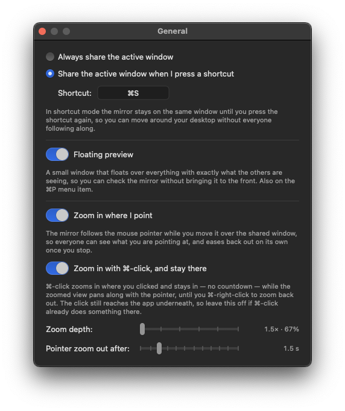
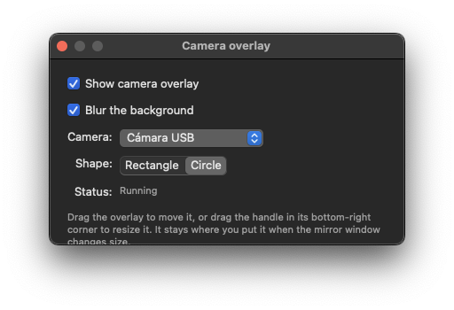

# SReflect

A macOS app that mirrors a single window into a plain black window, so you can
share *that* window on a call instead of your whole screen — and switch what the
other side sees without ever touching the meeting app's share picker.

You share the **mirror window** once (in Zoom, Meet, Slack, Teams…). From then on
the mirror follows whichever window you want to show. Your notifications, your
Slack DMs, your password manager stay out of it.


## What it does

- **Mirrors one window at a time** into a dedicated window you share once.
- **Follow modes** — follow the active (focused) window, or follow whatever window
  is under the cursor.
- **Share modes** — *automatic* (the mirror always tracks the active window) or
  *shortcut* (the mirror stays put until you press a global hotkey, so you can
  move around your desktop without an audience).
- **Freeze** — pin the mirror to the current window and stop following.
- **Never-shared apps** — blocklist by bundle ID. If a blocked app becomes the
  active window, the capture stops and the mirror goes plain black with a neutral
  "Content hidden" message that doesn't name the app.
- **Camera overlay** — webcam picture-in-picture on top of the mirror, rectangle or
  circle, drag to move and resize. Built-in, external and Continuity Camera
  (iPhone) devices, with optional background blur.
- **Floating preview** — a small panel showing exactly what the other side sees,
  so you can verify without bringing the big window forward.
- **Zoom in where you point** — the mirror eases in around the pointer so everyone
  sees the detail you are working on. It can *follow* the pointer and ease back
  out once you stop, or *hold*: `⌘`-click zooms in where you clicked and pans
  along with the pointer until you `⌘`-click again.
- **Fade between windows** — crossing from one window to another fades the old one
  out, holds a plate with the app icon and name, and fades the new one in. The
  other side never gets a hard cut, nor a frame of the incoming window before you
  finished switching.
- **Idle plate** — with nothing to mirror yet, the plate reads *Not sharing your
  screen*, so the other side knows they aren't seeing anything of yours.
- **Confetti** (`⌃⌘C`) — a burst of confetti falls over the mirror, so the other
  side sees it too. In the free edition each throw carries a small watermark; a
  [Pro key](#free-and-pro) takes it off.
- **Steps aside from the window it mirrors** — a mirror sitting on top of what it
  shows would give the other side two pointers, so it moves itself out of the
  captured region and grows back as soon as there is room again.
- **Two capture strategies** — crop the display (no "shared window" badge, and the
  target window keeps its window buttons), or capture the window as an entity
  (cleaner when other windows overlap).
- **Hide title bar** and **keep in front** for a clean, always-visible mirror.

## Requirements

- macOS 14 (Sonoma) or later.
- Screen Recording permission, and Camera permission if you use the overlay.

## Install with Homebrew

```bash
brew tap neri-bocchi/tap https://github.com/neri-bocchi/sreflect
brew trust neri-bocchi/tap
brew install --cask sreflect
```

This repo doubles as its own tap, which is why the tap command carries the URL —
there's no separate `homebrew-tap` repository to clone. Recent Homebrew refuses to
load casks from third-party taps until you trust them, hence the middle command;
`brew install` fails with *"Refusing to load cask … from untrusted tap"* without it.

That installs `SReflect.app` into `/Applications`, verifies the download's
checksum and clears the quarantine flag for you.

### Then grant Screen Recording

No installer can do this for you — macOS only accepts that grant from you, in
System Settings:

1. Launch SReflect. On first run it walks you through it: a window with the
   steps and a drawing of the row you're looking for — icon, name and the switch —
   plus a button that opens the pane.
2. **System Settings › Privacy & Security › Screen & System Audio Recording**
3. Enable SReflect and reopen the app. The window notices the grant on its own
   and offers to reopen for you.

Until it's granted the mirror just shows `Screen Recording permission required.`
The camera overlay (`⌘J`) asks for Camera permission separately, the first time
you turn it on. The zoom options need no permission of their own.

If the toggle is already on but the mirror stays black, the permission is stale —
reset it and relaunch:

```bash
tccutil reset ScreenCapture app.sreflect.mirror
```

### Upgrade and uninstall

```bash
brew upgrade --cask sreflect
brew uninstall --cask sreflect      # add --zap to drop preferences too
```

## Without opening the Terminal

`SReflect-Installer.dmg` on the [releases
page](https://github.com/neri-bocchi/sreflect/releases) carries an applet
that runs those same three commands for you, installing Homebrew first if it
isn't there. It isn't signed with an Apple identity, so the first launch needs
**System Settings › Privacy & Security › Open Anyway** — the `.dmg` ships a LÉEME
that walks through it. Screen Recording still has to be granted by hand, same as
above.

## Why the app isn't notarized

Releases are signed with a stable self-signed identity rather than a Developer ID,
so they're outside Apple's notarization path. Homebrew quarantines everything it
downloads and Gatekeeper refuses to open a quarantined app Apple never notarized,
so the cask strips that flag after installing — the signature itself stays intact,
which is what lets macOS keep your Screen Recording grant across upgrades.

## Using it on a call

1. Launch the app — the mirror window opens, black, waiting for a window.
2. In your meeting app, share the window titled **SReflect**.
3. Activate (or hover over) the window you want the others to see. The mirror
   picks it up; its title bar and the menu bar item show what's currently showing.
4. Pick **Freeze on this window** from the menu bar item when you need to look at
   something else.

Everything is reachable from the menu bar item (the `rectangle.on.rectangle`
icon), which turns into a lock icon while frozen.


| Action | Shortcut | Works |
| --- | --- | --- |
| Share the active window (shortcut mode) | `⌘S` by default, rebindable in General | anywhere |
| Throw confetti | `⌃⌘C` | anywhere |
| Follow the cursor | `⌘1` | in the app |
| Follow the active window | `⌘2` | in the app |
| Toggle capture strategy (window vs. display crop) | `⌘K` | in the app |
| Hide title bar | `⌘T` | in the app |
| Keep in front | `⌘F` | in the app |
| Floating preview | `⌘P` | in the app |
| Apps that are never shared… | `⌘,` | in the app |
| Camera overlay… | `⌘J` | in the app |
| General… | `⌘G` | in the app |
| Show mirror window | `⌘M` | in the app |
| Hide the app | `⌘H` | in the app |
| Quit | `⌘Q` | in the app |
| Hold a zoom and pan with the pointer | `⌘`-click (`⌘`-click again to let it go) | anywhere |

## Settings

- **General** — automatic vs. shortcut share mode, the share hotkey, the floating
  preview switch, and the zoom section: follow the pointer, hold a zoom with
  `⌘`-click, zoom depth and the follow-the-pointer zoom-out delay.

  

- **Camera overlay** — enable, pick the camera, rectangle or circle, background blur.

  

- **Apps that are never shared** — checkbox list of apps to block by bundle ID.

  

  When a checked app becomes the active window, the mirror goes black and says so
  without naming it:

  

## Notes and caveats

- The window tracker needs **no Accessibility permission** — not for mirroring,
  and not for the zoom either.
- The `⌘`-click zoom is read-only: the click still reaches the app under the
  pointer, so leave that switch off if `⌘`-click already means something there.
- **Tiling managers.** AeroSpace and yabai hide the workspaces you are not looking
  at by moving their windows off the display, and ScreenCaptureKit only captures
  what is on a display — a parked mirror reaches the other side as a thin vertical
  line. Keep the mirror on the workspace you are working in while you share.
- **Two pointers on a maximized window.** The mirror can only step out of the way
  of what it shows if there is somewhere to step. Share a window that fills the
  screen and the other side sees your pointer twice. Give the mirror its own space
  — a second display, or a window that doesn't fill the screen.
- Leave *keep in front* off while you are picking what to share: share pickers only
  list normal-level windows, so a mirror kept in front disappears from that list.

## Free and Pro

There is one app and one download. It runs free — for personal and commercial
work alike, on as many Macs as you like — and everything on this page is in the
free edition.

Pro is a license key you paste into **License…** in the menu. Today it takes the
watermark off the confetti, which is the one thing the free edition marks. More
will land there over time; nothing that is free now becomes paid later.

A key is a line of text, checked on your own Mac: no account, no sign-in, no
network call. Ask for one at lbocchi@gmail.com.

SReflect is proprietary software, © 2026 Luis Bocchi, all rights reserved.

---

Questions, bugs and commercial enquiries: lbocchi@gmail.com
